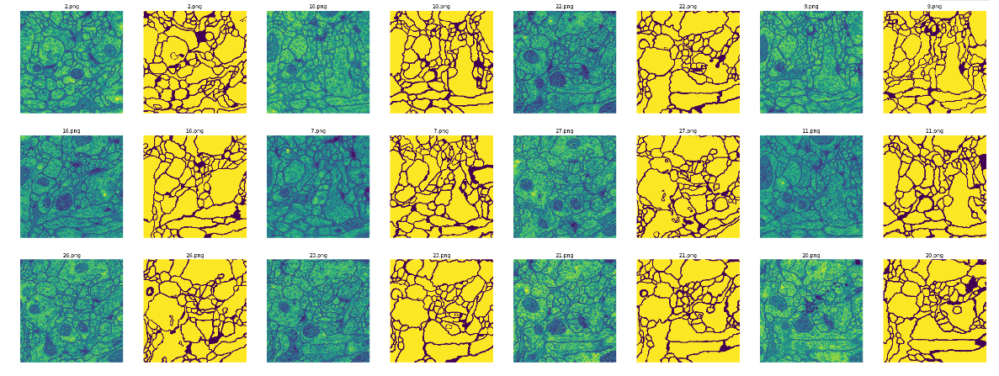
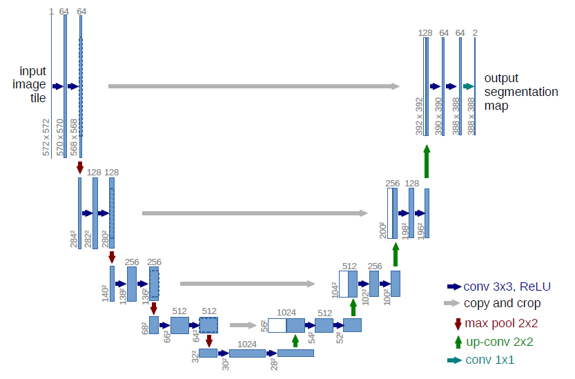
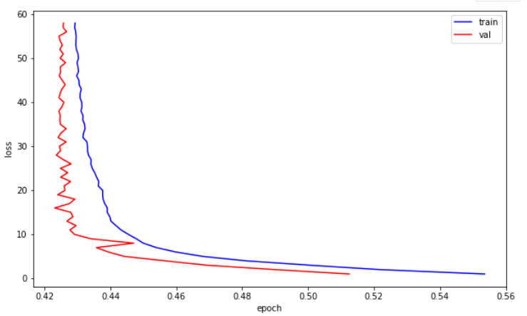
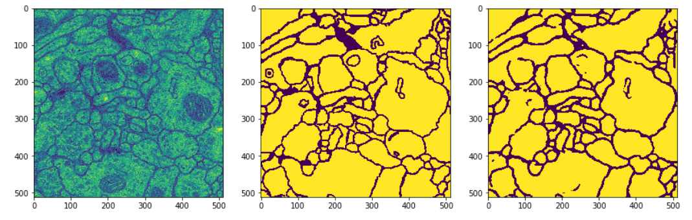

# unet.pytorch

This is my implementation of the [U-Net](https://arxiv.org/pdf/1505.04597.pdf) in Pytorch for [EM segmentation challenge](http://brainiac2.mit.edu/isbi_challenge/).

## Overview

### Data

The original dataset is from [EM segmentation challenge](http://brainiac2.mit.edu/isbi_challenge/), and I've downloaded it and done the pre-processing. You can find it in folder .data/.

### Data augmentation

I used the first 28 512×512 images to train and the rest of them for validating. Because there are very few training images, I applied some data augmentation, like random horizontal and vertical, to the images.

### Model

I made some modifications to the network structure in the paper. The input and output of this model are adjusted to 1×512×512. And a sigmoid function is applied to output of the last layer as well as the loss function is changed to BCELoss which is works for binary problems. Futher, each convolution layer is followed by a batch normalize layer.

### Training

Follow the paper, SGD optimizer with momentum of 0.99 and learning rate of 0.01 is used. To minimize the overhead and make maximum use of the GPU memory, batch size is set to 1.

The model is trained for 60 epochs with the learning rate multiply by 0.1 for every 30 epochs. 

## How to use

### Dependencies

This tutorial depends on the following libraries:

* PyTorch >= 0.4.0

Also, this code should be compatible with Python version 2.7-3.7.

### Results

The loss changed with eopch and the visualizations on the validation set are shown below.

